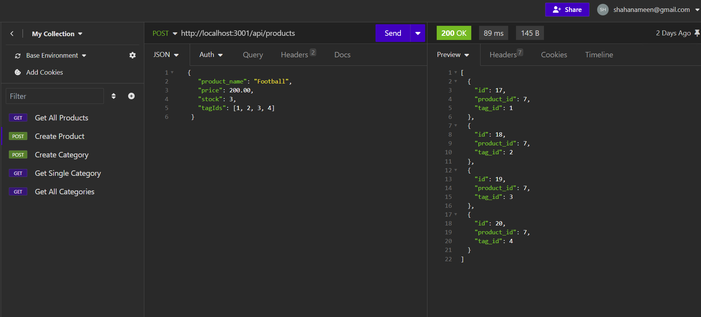

# Retail-ORM: University of Minnesota Bootcamp

## description
This homework assignment displays the relationship of the routing between the models and seeds folders. In this assignment npm commits make an important aspect on the assignment as it allows us to learn how to communicate to specifc folders, and creating our puts, posts, get, and delete options to verify the creditability of data.
## IMG

## URL
https://github.com/ShahanAmeen/Retail-ORM,  https://shahanameen.github.io/Retail-ORM/
## Author
Shahan Ameen
https://github.com/ShahanAmeen  